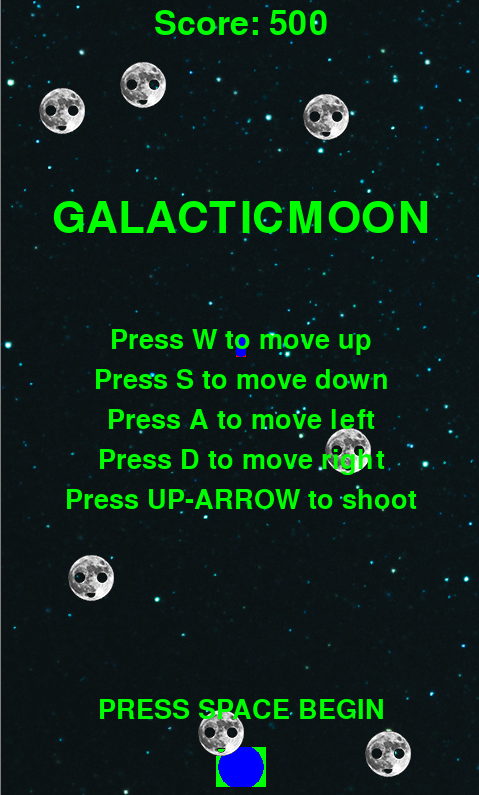

# Py-Invader

### Introduction:

`py-invader` is a Space Invaders inspired 2D arcade game written in Python using the pygame libraries

### Installation:

* Clone the repository `git clone https://github.com/omarkamalakis/py-invaders.git`
* Install dependencies `pygame`
* Run `python galacticmoon.py`

### Maintainers:

* Abraham
* Gabe
* Victor
* Leon
